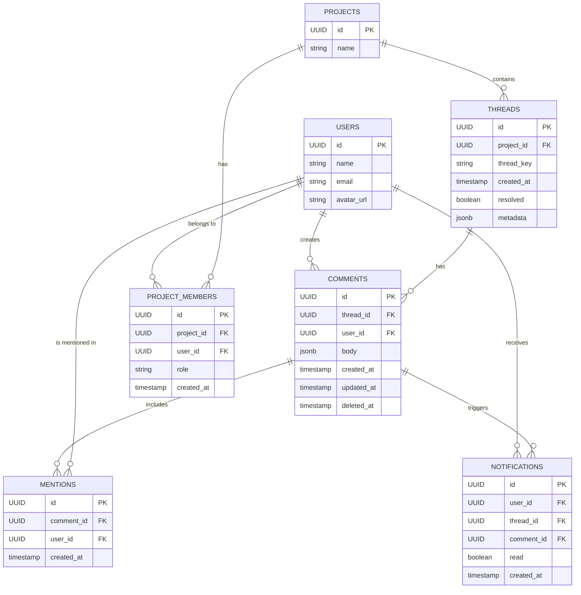

# Comments System Design

## Overview

This document outlines the design for a Liveblocks-like comments system for DDN. The system supports threaded comments, mentions, notifications, and both anonymous and authenticated users.

## Mermaid Diagram



## Features

1. **Threaded Comments**: Comments are organized into threads, each associated with a specific project and identified by a unique `thread_key`.
   - `threads` table with `project_id` and `thread_key`
   - `comments` table with `thread_id` for organization

2. **Anonymous and Authenticated Comments**: The system supports both anonymous and authenticated comments.
    - Consider adding permission checks using `project_members` roles

3. **Mentions**: Users can be mentioned in comments using the `@` symbol. Mentions are automatically detected and processed from the comment body.
      - Consider restricting mentions to only project members
   - Add validation against `project_members` table

4. **Notifications**: Users receive notifications when they are mentioned in a comment or when there's activity in a thread they're participating in.
     - Links users, threads, and comments effectively

5. **Thread Resolution**: Threads can be marked as resolved, allowing for easy management of discussions.
- Consider adding role-based resolution permissions

6. **Comment Deletion**: Comments can be soft-deleted, maintaining the integrity of the conversation while allowing for content moderation.
 - Enables soft deletion while maintaining thread integrity

7. **Real-time Updates**: Initially implemented using polling, with the possibility to extend to GraphQL subscriptions in the future.

8. **Project Access Control**
   - Only project members can view/create threads
   - Different capabilities based on role (owner/admin/member)
   - Enforced through `project_members` table checks

### Other Features Possible with this schema

1. **Role-Based Permissions**
   - Control thread creation based on project role. Restrict thread resolution to owners/admins

2.  **Member-Only Mentions**
    - Restrict @mentions to current project members. Prevent mentions of users outside the project

3.  **Project Activity Dashboard**
    - Track member participation and engagement. Monitor thread creation/resolution by role

4.  **Thread Visibility Control**
    - Private threads visible only to specific roles. Confidential discussions limited to admins/owners

5.  **Role-Based Notifications**
    - Notify all admins of new threads. Alert owners of unresolved threads. 


## Setup Instructions

1. Git Clone this repo: https://github.com/hasura/ddn-comments.git and cd into `ddn-comments/commserver`
   
2. Using the `up.sql' and 'postgresql_seed.sql' files set up a PostgreSQL database. Can use sample [Neon Db](https://neon.tech/) to do that.
   
3. Change the value for `APP_MY_CONNECTOR_CONNECTION_URI` in files `commserver/.env` and `commserver/.env.cloud`

4. Build the supergraph locally using the following command 
```shell 
   ddn supergraph build local 
```

5. Run Docker. For local development, Hasura runs several services (engine, connectors, auth, etc.), which use the following ports: 3000, 4317 and so on. Please ensure these ports are available. If not, modify the published ports in the Docker Compose files from this repository accordingly.
```shell 
   ddn run docker-start
```

6. Check out the console to discover and test the GraphQL API 
```shell 
   ddn console --local
``` 

## GraphQL Queries and Mutations

### Queries

1. Get Threads for a Project

```graphql
query GetThreads($projectId: Uuid, $resolved: Bool) {
  threads(
    where: {
      projectId: { _eq: $projectId },
      resolved: { _eq: $resolved }
    }
    order_by: { createdAt: Desc }
  ) {
    id
    threadKey
    resolved
    metadata
    comments(order_by: { createdAt: Asc }) {
      id
      body
      createdAt
      updatedAt
      deletedAt
      user {
        id
        name
        avatarUrl
      }
      mentions {
        user {
          id
          name
        }
      }
    }
  }
}

{
  "resolved": false,
  "projectId": "fe7a8c51-0d50-4f41-b033-e0c3c49a4dec"
}
```

2. Get Users for Mentions

```graphql
query GetUsers($searchText: Varchar) {
  users(where: { name: { _ilike: $searchText } }) {
    id
    name
    avatarUrl
  }
}

{
  "searchText": "Alice Smith"
}
```

3. Get Notifications for a User

```graphql
query GetNotifications($userId: Uuid!) {
  notifications(
    where: { userId: { _eq: $userId } }
    order_by: { createdAt: Desc }
  ) {
    id
    thread {
      id
      threadKey
      project {
        id
        name
      }
    }
    comment {
      id
      body
      user {
        id
        name
      }
    }
    read
    createdAt
  }
}

{
  "userId": "579de195-fa14-4b9f-ba49-2fd6e38a0f5b"
}
```

### Mutations

1. Create Thread and Initial Comment

```graphql
mutation CreateThread(
  $id: Uuid!,
  $projectId: Uuid!,
  $threadKey: Varchar!,
  $metadata: Jsonb
) {
  insertThreads(
    objects: [{
      id: $id,
      projectId: $projectId,
      threadKey: $threadKey,
      metadata: $metadata
    }]
  ) {
    affectedRows
    returning {
      id
      threadKey
      metadata
      createdAt
      resolved
    }
  }
}
```
```graphql
mutation insertComments(
  $id: Uuid!,
  $body: Jsonb!,
  $userid: Uuid!
  $threadid: Uuid!
){
  insertComments (
    objects:[{
      body: $body
      userId: $userid
      id: $id
      threadId: $threadid
    }]
  ) {
    affectedRows
    returning{
      body
      id
    }
  }
}
```

<!-- ```graphql
# mutation CreateThreadAndComment(
#   $projectId: UUID!
#   $threadKey: String!
#   $userId: UUID
#   $body: jsonb!
#   $metadata: jsonb
# ) {
#   insert_threads_one(
#     object: {
#       project_id: $projectId
#       thread_key: $threadKey
#       metadata: $metadata
#       comments: { data: { user_id: $userId, body: $body } }
#     }
#   ) {
#     id
#     thread_key
#     comments {
#       id
#       body
#       user {
#         id
#         name
#       }
#     }
#   }
# } -->
```

3. Resolve Thread

```graphql
mutation ResolveThread(
  $threadId: Uuid!, 
) {
  updateThreadsById(
    keyId: $threadId,
    updateColumns: {
      resolved:{
        set: true
      }
    }
  ) {
    affectedRows
    returning {
      id
      resolved
    }
  }
}
```

4. Delete Comment

```graphql
mutation DeleteComment($commentId: Uuid!) {
  deleteCommentsById(
    keyId: $commentId
  ) {
    affectedRows
    returning {
      id
      deletedAt
    }
  }
}
```

5. Mark Notification as Read

```graphql
mutation MarkNotificationAsRead($notificationId: Uuid!) {
  updateNotificationsById(
    keyId: $notificationId,
    updateColumns: {
      read: {
        set: true
      }
    }
  ) {
    affectedRows
    returning {
      id
      read
    }
  }
}
```

## Implementation Notes
for supporting key features such as threaded discussions, mentions, and notifications.

- Mentions should be automatically detected and processed from the comment body when creating or updating comments.
- The system should parse the comment body for `@` mentions and create the appropriate entries in the `mentions` table.
- Initially, use polling to simulate real-time updates. This can be extended to use GraphQL subscriptions in the future for true real-time functionality.
- Ensure proper indexing on frequently queried fields (e.g., `thread_key`, `user_id`, `thread_id`) for optimal performance.
  - Other indexing recommendations - `project_members(project_id, user_id, role)`,  `project_members(user_id, role)`,  `comments(user_id, created_at)`

