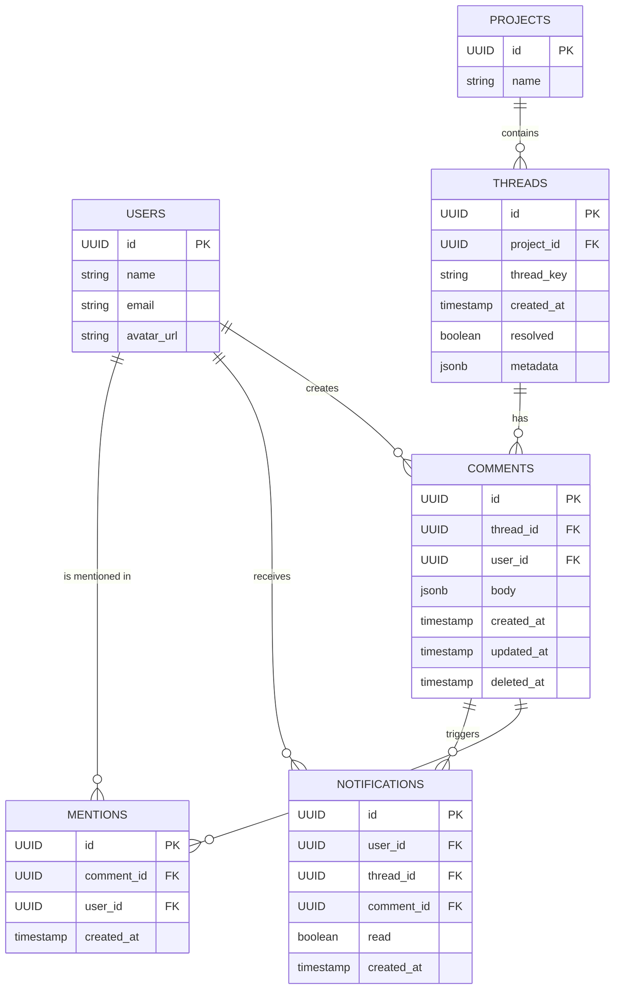

# Comments System Design

## Overview

This document outlines the design for a Liveblocks-like comments system for DDN. The system supports threaded comments, mentions, notifications, and both anonymous and authenticated users.

## Mermaid Diagram



## Features

1. **Threaded Comments**: Comments are organized into threads, each associated with a specific project and identified by a unique `thread_key`.

2. **Anonymous and Authenticated Comments**: The system supports both anonymous and authenticated comments.

3. **Mentions**: Users can be mentioned in comments using the `@` symbol. Mentions are automatically detected and processed from the comment body.

4. **Notifications**: Users receive notifications when they are mentioned in a comment or when there's activity in a thread they're participating in.

5. **Thread Resolution**: Threads can be marked as resolved, allowing for easy management of discussions.

6. **Comment Deletion**: Comments can be soft-deleted, maintaining the integrity of the conversation while allowing for content moderation.

7. **Real-time Updates**: Initially implemented using polling, with the possibility to extend to GraphQL subscriptions in the future.

## Data Model

### Users Table

```sql
CREATE TABLE users (
  id UUID PRIMARY KEY,
  name VARCHAR(255) NOT NULL,
  email VARCHAR(255) UNIQUE NOT NULL,
  avatar_url TEXT
);
```

### Projects Table

```sql
CREATE TABLE projects (
  id UUID PRIMARY KEY,
  name VARCHAR(255) NOT NULL
);
```

### Threads Table

```sql
CREATE TABLE threads (
  id UUID PRIMARY KEY,
  project_id UUID NOT NULL REFERENCES projects(id),
  thread_key VARCHAR(255) NOT NULL,
  created_at TIMESTAMP WITH TIME ZONE DEFAULT CURRENT_TIMESTAMP,
  resolved BOOLEAN DEFAULT FALSE,
  metadata JSONB,
  UNIQUE(project_id, thread_key)
);
```

### Comments Table

```sql
CREATE TABLE comments (
  id UUID PRIMARY KEY,
  thread_id UUID NOT NULL REFERENCES threads(id),
  user_id UUID REFERENCES users(id),
  body JSONB NOT NULL,
  created_at TIMESTAMP WITH TIME ZONE DEFAULT CURRENT_TIMESTAMP,
  updated_at TIMESTAMP WITH TIME ZONE DEFAULT CURRENT_TIMESTAMP,
  deleted_at TIMESTAMP WITH TIME ZONE
);
```

### Mentions Table

```sql
CREATE TABLE mentions (
  id UUID PRIMARY KEY,
  comment_id UUID NOT NULL REFERENCES comments(id),
  user_id UUID NOT NULL REFERENCES users(id),
  created_at TIMESTAMP WITH TIME ZONE DEFAULT CURRENT_TIMESTAMP
);
```

### Notifications Table

```sql
CREATE TABLE notifications (
  id UUID PRIMARY KEY,
  user_id UUID NOT NULL REFERENCES users(id),
  thread_id UUID NOT NULL REFERENCES threads(id),
  comment_id UUID NOT NULL REFERENCES comments(id),
  read BOOLEAN DEFAULT FALSE,
  created_at TIMESTAMP WITH TIME ZONE DEFAULT CURRENT_TIMESTAMP
);
```

## GraphQL Queries and Mutations

### Queries

1. Get Threads for a Project

```graphql
query GetThreads($projectId: UUID!, $resolved: Boolean) {
  threads(
    where: { project_id: { _eq: $projectId }, resolved: { _eq: $resolved } }
    order_by: { created_at: desc }
  ) {
    id
    thread_key
    resolved
    metadata
    comments(order_by: { created_at: asc }) {
      id
      body
      created_at
      updated_at
      deleted_at
      user {
        id
        name
        avatar_url
      }
      mentions {
        user {
          id
          name
        }
      }
    }
  }
}
```

2. Get Users for Mentions

```graphql
query GetUsers($searchText: String) {
  users(where: { name: { _ilike: $searchText } }) {
    id
    name
    avatar_url
  }
}
```

3. Get Notifications for a User

```graphql
query GetNotifications($userId: UUID!) {
  notifications(
    where: { user_id: { _eq: $userId } }
    order_by: { created_at: desc }
  ) {
    id
    thread {
      id
      thread_key
      project {
        id
        name
      }
    }
    comment {
      id
      body
      user {
        id
        name
      }
    }
    read
    created_at
  }
}
```

### Mutations

1. Create Thread and Initial Comment

```graphql
mutation CreateThreadAndComment(
  $projectId: UUID!
  $threadKey: String!
  $userId: UUID
  $body: jsonb!
  $metadata: jsonb
) {
  insert_threads_one(
    object: {
      project_id: $projectId
      thread_key: $threadKey
      metadata: $metadata
      comments: { data: { user_id: $userId, body: $body } }
    }
  ) {
    id
    thread_key
    comments {
      id
      body
      user {
        id
        name
      }
    }
  }
}
```

2. Add Comment to Thread

```graphql
mutation AddComment($threadId: UUID!, $userId: UUID, $body: jsonb!) {
  insert_comments_one(
    object: { thread_id: $threadId, user_id: $userId, body: $body }
  ) {
    id
    body
    user {
      id
      name
    }
  }
}
```

3. Resolve Thread

```graphql
mutation ResolveThread($threadId: UUID!) {
  update_threads_by_pk(
    pk_columns: { id: $threadId }
    _set: { resolved: true }
  ) {
    id
    resolved
  }
}
```

4. Delete Comment

```graphql
mutation DeleteComment($commentId: UUID!) {
  update_comments_by_pk(
    pk_columns: { id: $commentId }
    _set: { deleted_at: "now()" }
  ) {
    id
    deleted_at
  }
}
```

5. Mark Notification as Read

```graphql
mutation MarkNotificationAsRead($notificationId: UUID!) {
  update_notifications_by_pk(
    pk_columns: { id: $notificationId }
    _set: { read: true }
  ) {
    id
    read
  }
}
```

## Implementation Notes

- Mentions should be automatically detected and processed from the comment body when creating or updating comments.
- The system should parse the comment body for `@` mentions and create the appropriate entries in the `mentions` table.
- Initially, use polling to simulate real-time updates. This can be extended to use GraphQL subscriptions in the future for true real-time functionality.
- Ensure proper indexing on frequently queried fields (e.g., `thread_key`, `user_id`, `thread_id`) for optimal performance.
- Implement proper access control to ensure users can only interact with threads and comments they have permission to view or modify.

This structure provides a solid foundation for implementing a Liveblocks-like comments system in your console frontend, supporting the key features of threaded discussions, mentions, and notifications.
