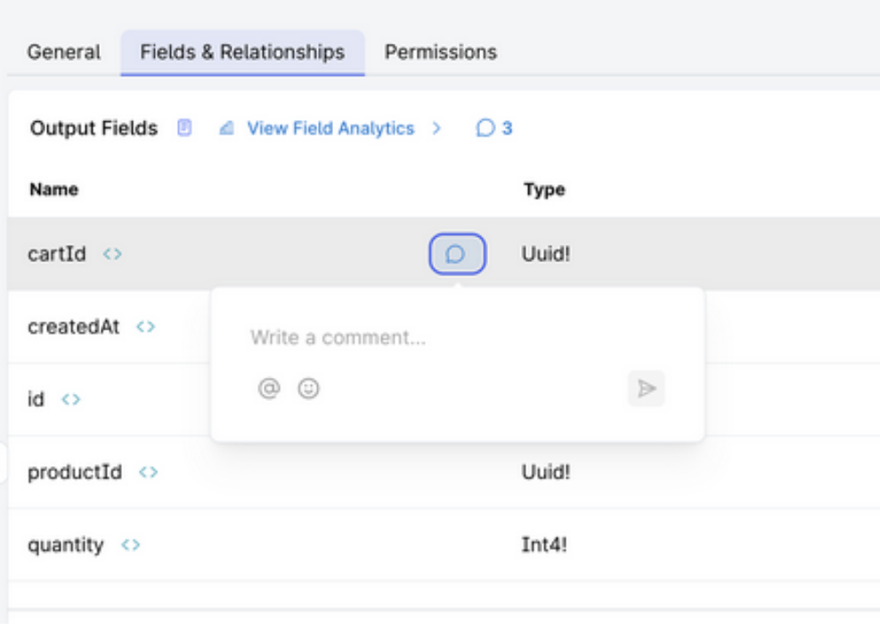
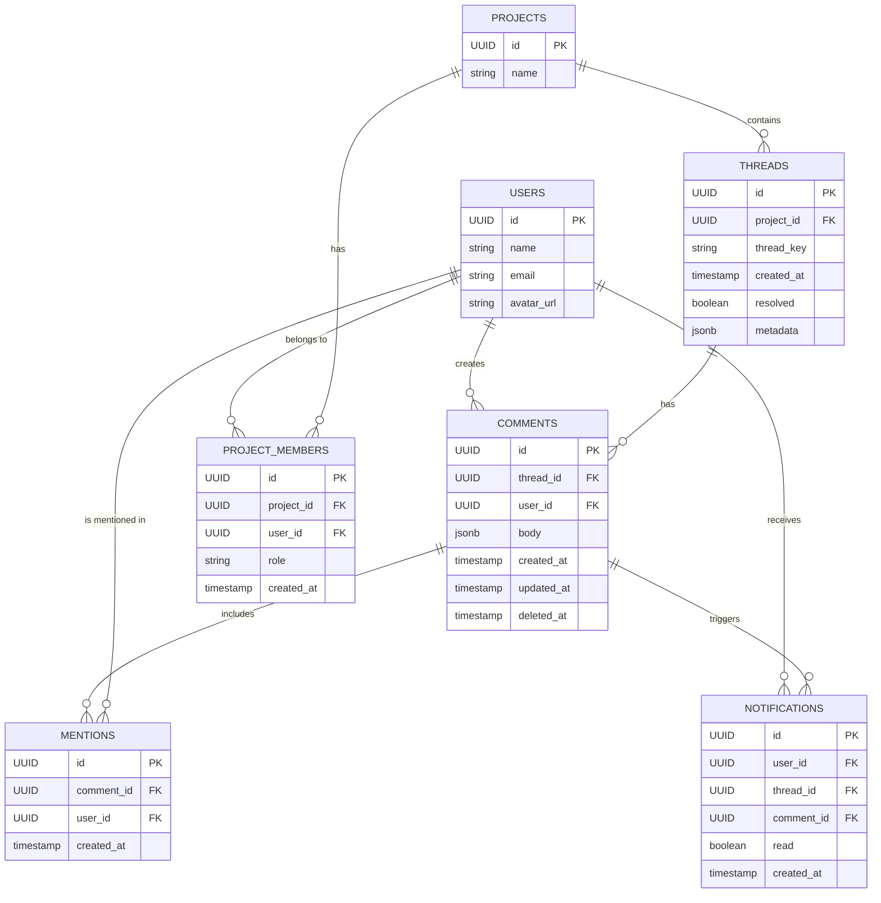
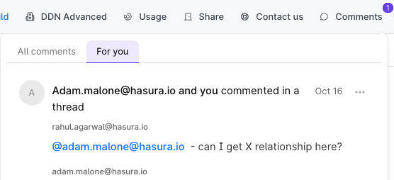

# Table of Contents

- [Table of Contents](#table-of-contents)
- [Commenting DDN Server](#commenting-ddn-server)
  - [Comments System Design](#comments-system-design)
    - [Overview](#overview)
    - [Entity Relationship Diagram](#entity-relationship-diagram)
    - [Features](#features)
    - [Other Features Possible with this schema](#other-features-possible-with-this-schema)
  - [Setup Instructions](#setup-instructions)
  - [DDN Metadata Modeling](#ddn-metadata-modeling)
    - [Models](#models)
    - [Commands](#commands)
    - [Relationships](#relationships)
    - [Permissions](#permissions)
  - [GraphQL Queries and Mutations](#graphql-queries-and-mutations)
    - [Queries](#queries)
    - [Mutations](#mutations)
    - [Subscriptions](#subscriptions)
  - [REST API](#rest-api)
  - [Implementation Notes](#implementation-notes)

# Commenting DDN Server 

Unlocks collaboration in your application by closing feedback loops with consumers

## Comments System Design

### Overview

This document outlines the design for a Liveblocks.io or  Velt like comments system built on DDN. The system supports threaded comments, mentions, notifications, and both anonymous and authenticated users.



### Entity Relationship Diagram



### Features

1. **Threaded Comments**: Comments are organized into threads, each associated with a specific project and identified by a unique `thread_key`.
   - `threads` table with `project_id` and `thread_key`
   - `comments` table with `thread_id` for organization

2. **Real-time Updates**: Initially implemented using polling, with the possibility to extend to GraphQL subscriptions in the future.

3. **Mentions**: Users can be mentioned in comments using the `@` symbol. Mentions are automatically detected and processed from the comment body.
      - Consider restricting mentions to only project members
   - Add validation against `project_members` table

4. **Notifications**: Users receive notifications when they are mentioned in a comment or when there's activity in a thread they're participating in.
     - Links users, threads, and comments effectively

5. **Project Access Control**
   - Only project members can view/create threads
   - Different capabilities based on role (owner/admin/member)
   - Enforced through `project_members` table checks

6. **Thread Resolution**: Threads can be marked as resolved, allowing for easy management of discussions.
- Consider adding role-based resolution permissions

7. **Comment Deletion**: Comments can be soft-deleted, maintaining the integrity of the conversation while allowing for content moderation.
 - Enables soft deletion while maintaining thread integrity

8. **Anonymous and Authenticated Comments**: The system supports both anonymous and authenticated comments.
  - Consider adding permission checks using `project_members` roles


### Other Features Possible with this schema

1. **Role-Based Permissions** Control thread creation based on project role. Restrict thread resolution to owners/admins

2.  **Member-Only Mentions** Restrict @mentions to current project members. Prevent mentions of users outside the project

3.  **Project Activity Dashboard** Track member participation and engagement. Monitor thread creation/resolution by role

4.  **Thread Visibility Control** Private threads visible only to specific roles. Confidential discussions limited to admins/owners

5.  **Role-Based Notifications** Notify all admins of new threads. Alert owners of unresolved threads. 


## Setup Instructions

1. Git Clone this repo: https://github.com/hasura/ddn-comments.git and cd into `ddn-comments/commserver`
   
2. Using the `up.sql' and 'postgresql_seed.sql' files set up a PostgreSQL database.

   - You can check out [DDN Postgres connector documentation](https://hasura.io/docs/3.0/connectors/postgresql/local-postgres) to set up a Postgres Database locally to test this schema out.
     - Hasura CLI automatically creates DDN metadata based on the underlying database schema information.
   - Or you can use sample [Neon Db](https://neon.tech/) and provide that URL in step 3 below.
     - Here is a sample db -  `postgresql://rahul.agarwal@ep-flat-bird-897996.us-east-2.aws.neon.tech/hardy-reindeer-37_db?sslmode=require` for you to use to run this demo.
   
3. Change the value for `APP_MY_CONNECTOR_CONNECTION_URI` in files `commserver/.env` and `commserver/.env.cloud`

4. Build the supergraph locally using the following command 
```shell 
   ddn supergraph build local 
```

1. Run Docker. For local development, Hasura runs several services (engine, connectors, auth, etc.), which use the following ports: 3000, 4317 and so on. Please ensure these ports are available. If not, modify the published ports in the Docker Compose files from this repository accordingly.
```shell 
   ddn run docker-start
```

1. Check out the console to discover and test the GraphQL API 
```shell 
   ddn console --local
``` 

Follow [these instructions](https://github.com/hasura/ddn-sample-app?tab=readme-ov-file#deploy-to-ddn-cloud) to go to cloud.

## DDN Metadata Modeling

Hasura DDN uses a code-first, semantic metadata layer to centralize your data definitions, relationships, and permissions in one place.

### Models

Models represent the entities — such as tables, views, or collections — in your data source, defining the structure and how the data can be accessed.

```yaml
---
kind: Model
version: v1
definition:
  name: Comments
  objectType: Comments
  source:
    dataConnectorName: my_connector
    collection: comments
  filterExpressionType: CommentsBoolExp
  aggregateExpression: CommentsAggExp
  orderableFields:
    - fieldName: body
      orderByDirections:
        enableAll: true
    - fieldName: createdAt
      orderByDirections:
        enableAll: true
    - fieldName: deletedAt
      orderByDirections:
        enableAll: true
    - fieldName: id
      orderByDirections:
        enableAll: true
    - fieldName: threadId
      orderByDirections:
        enableAll: true
    - fieldName: updatedAt
      orderByDirections:
        enableAll: true
    - fieldName: userId
      orderByDirections:
        enableAll: true
  graphql:
    selectMany:
      queryRootField: comments
      subscription:
        rootField: comments
        description: Subscribe to comments model
    selectUniques:
      - queryRootField: commentsById
        uniqueIdentifier:
          - id
    orderByExpressionType: CommentsOrderBy
    filterInputTypeName: CommentsFilterInput
    aggregate:
      queryRootField: commentsAggregate
      subscription:
        rootField: commentAggregate
```

### Commands

Commands enable you to perform actions that modify data — such a perform updates or inserts — in your data source. Commands also allow you to execute custom business logic directly via your API.

```yaml
kind: Command
version: v1
definition:
  name: InsertComments
  outputType: InsertCommentsResponse!
  arguments:
    - name: objects
      type: "[InsertCommentsObject!]!"
    - name: postCheck
      type: CommentsBoolExp
      description: Insert permission predicate over the 'comments' collection
  source:
    dataConnectorName: my_connector
    dataConnectorCommand:
      procedure: insert_comments
    argumentMapping:
      objects: objects
      postCheck: post_check
  graphql:
    rootFieldName: insertComments
    rootFieldKind: Mutation
```

### Relationships

Relationships allow you to connect data, enabling you to query data across multiple entities.

```yaml
kind: Relationship
version: v1
definition:
  name: user
  sourceType: Comments
  target:
    model:
      name: Users
      relationshipType: Object
  mapping:
    - source:
        fieldPath:
          - fieldName: userId
      target:
        modelField:
          - fieldName: id
```

### Permissions

Permissions allow you to control who can access your data and what they can do with it. You can define permissions to restrict access to certain models, the fields they contain, and the operations that can be performed on them.

To restrict which fields can be queried, you can create a permission for a type.

```yaml
kind: TypePermissions
version: v1
definition:
  typeName: Comments
  permissions:
    - role: user
      output:
        allowedFields:
          - id
          - threadId
          - userId
          - body
    - role: anonymous
      output:
        allowedFields:
          - body
```

To implement row-level security, you can create a permission for a model.
```yaml
kind: ModelPermissions
version: v1
definition:
  modelName: Comments
  permissions:
    - role: admin
      select:
        filter: null
        allowSubscriptions: true
    - role: user
      select:
        filter:
          relationship:
            name: thread
            predicate:
              relationship:
                name: project
                predicate:
                  relationship:
                    name: projectMembers
                    predicate:
                      fieldComparison:
                        field: userId
                        operator: _eq
                        value:
                          sessionVariable: x-hasura-user-id
```
To determine which operations can be performed by which roles, you can create a permission for a command.

```yaml
kind: CommandPermissions
version: v1
definition:
  commandName: InsertComments
  permissions:
    - role: admin
      allowExecution: true
    - role: user
      allowExecution: true
      argumentPresets:
        - argument: objects
          value:
            literal:
              - userId:
                  sessionVariable: x-hasura-user-id
```


## GraphQL Queries and Mutations

### Queries

1. Get Threads for a Project

```graphql
query GetThreads($projectId: Uuid, $resolved: Bool) {
  threads(
    where: {
      projectId: { _eq: $projectId },
      resolved: { _eq: $resolved }
    }
    order_by: { createdAt: Desc }
  ) {
    id
    threadKey
    resolved
    metadata
    createdAt
    comments(order_by: { createdAt: Asc }) {
      id
      body
      createdAt
      updatedAt
      deletedAt
      user {
        id
        name
        avatarUrl
      }
      mentions {
        createdAt
        user {
          id
          name
        }
      }
    }
  }
}

{
  "resolved": false,
  "projectId": "fe7a8c51-0d50-4f41-b033-e0c3c49a4dec"
}
```

2. Get Users for Mentions

```graphql
query GetUsers($searchText: Varchar) {
  users(where: { name: { _ilike: $searchText } }) {
    id
    name
    avatarUrl
  }
}

{
  "searchText": "Alice Smith"
}
```

3. Get Notifications for a User

```graphql
query GetNotifications($userId: Uuid!) {
  notifications(
    where: { userId: { _eq: $userId } }
    order_by: { createdAt: Desc }
  ) {
    id
    thread {
      id
      threadKey
      project {
        id
        name
      }
    }
    comment {
      id
      body
      user {
        id
        name
      }
    }
    read
    createdAt
  }
}

{
  "userId": "579de195-fa14-4b9f-ba49-2fd6e38a0f5b"
}
```

### Mutations

1. Create Thread and Initial Comment

```graphql
mutation CreateThread(
  $id: Uuid!,
  $projectId: Uuid!,
  $threadKey: Varchar!,
  $metadata: Jsonb
) {
  insertThreads(
    objects: [{
      id: $id,
      projectId: $projectId,
      threadKey: $threadKey,
      metadata: $metadata
    }]
  ) {
    affectedRows
    returning {
      id
      threadKey
      metadata
      createdAt
      resolved
    }
  }
}
```
```graphql
mutation insertComments(
  $id: Uuid!,
  $body: Jsonb!,
  $userid: Uuid!
  $threadid: Uuid!
){
  insertComments (
    objects:[{
      body: $body
      userId: $userid
      id: $id
      threadId: $threadid
    }]
  ) {
    affectedRows
    returning{
      body
      id
    }
  }
}
```

3. Resolve Thread

```graphql
mutation ResolveThread(
  $threadId: Uuid!, 
) {
  updateThreadsById(
    keyId: $threadId,
    updateColumns: {
      resolved:{
        set: true
      }
    }
  ) {
    affectedRows
    returning {
      id
      resolved
    }
  }
}
```

4. Delete Comment

```graphql
mutation DeleteComment($commentId: Uuid!) {
  deleteCommentsById(
    keyId: $commentId
  ) {
    affectedRows
    returning {
      id
      deletedAt
    }
  }
}
```

5. Mark Notification as Read

```graphql
mutation MarkNotificationAsRead($notificationId: Uuid!) {
  updateNotificationsById(
    keyId: $notificationId,
    updateColumns: {
      read: {
        set: true
      }
    }
  ) {
    affectedRows
    returning {
      id
      read
    }
  }
}
```

### Subscriptions

We want to know what are the threads that are associated with this project and what comments they have. 
This way we will be able to show it on the notifications tab and comment bubbles. 


1. Subscription on Threads

```graphql
ssubscription Threads ($projectID: Uuid!) {
  threads(where: {project: {id: {_eq: $projectID}}}) {
    comments {
      body
      id
    }
    id
    createdAt
    threadKey
  }
}

{
  "projectID":"fe7a8c51-0d50-4f41-b033-e0c3c49a4dec"
}
```
## REST API

 DDN also supports JSON API as output. The feature is out in experimental phase.
  Run the following command to  fetch the openapi JSON file. An example of the swagger file is shown here.
```shel
  curl http://localhost:3000/v1/rest/__schema > comments_openapi.json
  ```

## Implementation Notes
for supporting key features such as threaded discussions, mentions, and notifications.

- Mentions should be automatically detected and processed from the comment body when creating or updating comments.
- The system should parse the comment body for `@` mentions and create the appropriate entries in the `mentions` table.
- Ensure proper indexing on frequently queried fields (e.g., `thread_key`, `user_id`, `thread_id`) for optimal performance.
  - Other indexing recommendations - `project_members(project_id, user_id, role)`,  `project_members(user_id, role)`,  `comments(user_id, created_at)`
